# SIM - Diagram Sistem Informasi Manajemen Asrama

Dokumen ini berisi diagram use case, activity, dan sequence untuk halaman utama aplikasi. Diagram menggunakan Mermaid dan bisa dirender di preview Markdown yang mendukung Mermaid.

## Catatan Pemodelan

- Aktor aplikasi: Admin, Pengasuh, Ustadz, dan Ustadzah.
- Menu yang tampak ditentukan oleh `akses_menu` milik user. Admin dapat mengatur akses tersebut di Manajemen User.
- Hak aksi tetap diperiksa di API berdasarkan role. Memiliki menu tidak otomatis memberi hak untuk menghapus atau mengelola user.
- Browser mengirim request API dengan JWT pada header `Authorization: Bearer <token>`.
- Database utama adalah MySQL/MariaDB.
- Data Asrama dan Kamar di halaman Manajemen Asrama saat ini disimpan di `localStorage`, bukan melalui API/database.
- Status Perizinan: `pending`, `disetujui`, `ditolak`. Persetujuan adalah status akhir dan membuat nomor surat.

## 1. Use Case Diagram

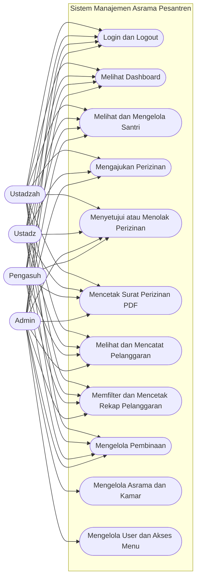
```mermaid
flowchart LR
    Admin([Admin])
    Pengasuh([Pengasuh])
    Ustadz([Ustadz])
    Ustadzah([Ustadzah])

    subgraph Aplikasi[ Sistem Manajemen Asrama Pesantren ]
        Login([Login dan Logout])
        Dashboard([Melihat Dashboard])
        Santri([Melihat dan Mengelola Santri])
        Perizinan([Mengajukan Perizinan])
        Approval([Menyetujui atau Menolak Perizinan])
        CetakSurat([Mencetak Surat Perizinan PDF])
        Pelanggaran([Melihat dan Mencatat Pelanggaran])
        RekapPelanggaran([Memfilter dan Mencetak Rekap Pelanggaran])
        Pembinaan([Mengelola Pembinaan])
        Asrama([Mengelola Asrama dan Kamar])
        User([Mengelola User dan Akses Menu])
    end

    Admin --> Login
    Pengasuh --> Login
    Ustadz --> Login
    Ustadzah --> Login

    Admin --> Dashboard
    Pengasuh --> Dashboard
    Ustadz --> Dashboard
    Ustadzah --> Dashboard

    Admin --> Santri
    Pengasuh --> Santri
    Ustadz --> Santri
    Ustadzah --> Santri

    Admin --> Perizinan
    Ustadz --> Perizinan
    Ustadzah --> Perizinan
    Pengasuh --> Approval
    Admin --> Approval
    Ustadz --> Approval
    Ustadzah --> Approval
    Admin --> CetakSurat
    Pengasuh --> CetakSurat
    Ustadz --> CetakSurat
    Ustadzah --> CetakSurat

    Admin --> Pelanggaran
    Pengasuh --> Pelanggaran
    Ustadz --> Pelanggaran
    Ustadzah --> Pelanggaran
    Admin --> RekapPelanggaran
    Pengasuh --> RekapPelanggaran
    Ustadz --> RekapPelanggaran
    Ustadzah --> RekapPelanggaran

    Admin --> Pembinaan
    Pengasuh --> Pembinaan
    Ustadz --> Pembinaan
    Ustadzah --> Pembinaan
    Admin --> Asrama
    Admin --> User
```

Akses menu tiap akun tetap mengikuti pilihan Admin. Diagram di atas menunjukkan hak default; API tetap menolak aksi yang tidak diizinkan oleh role.

## 2. Login

### Activity Diagram

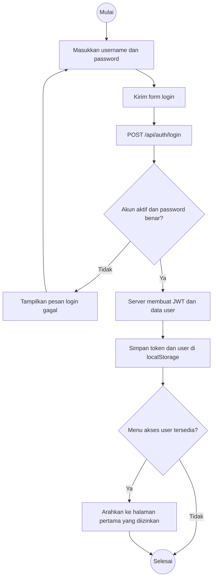
```mermaid
flowchart TD
    Start((Mulai)) --> Form[Masukkan username dan password]
    Form --> Submit[Kirim form login]
    Submit --> API[POST /api/auth/login]
    API --> Active{Akun aktif dan password benar?}
    Active -- Tidak --> Error[Tampilkan pesan login gagal]
    Error --> Form
    Active -- Ya --> Token[Server membuat JWT dan data user]
    Token --> Store[Simpan token dan user di localStorage]
    Store --> Access{Menu akses user tersedia?}
    Access -- Tidak --> Exit((Selesai))
    Access -- Ya --> Redirect[Arahkan ke halaman pertama yang diizinkan]
    Redirect --> Exit
```

### Sequence Diagram

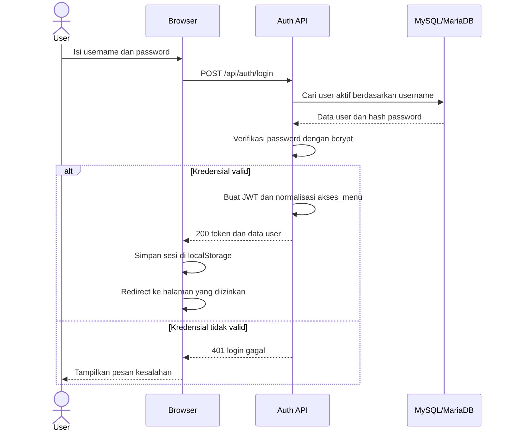
```mermaid
sequenceDiagram
    actor User
    participant Browser
    participant Auth as Auth API
    participant DB as MySQL/MariaDB

    User->>Browser: Isi username dan password
    Browser->>Auth: POST /api/auth/login
    Auth->>DB: Cari user aktif berdasarkan username
    DB-->>Auth: Data user dan hash password
    Auth->>Auth: Verifikasi password dengan bcrypt
    alt Kredensial valid
        Auth->>Auth: Buat JWT dan normalisasi akses_menu
        Auth-->>Browser: 200 token dan data user
        Browser->>Browser: Simpan sesi di localStorage
        Browser->>Browser: Redirect ke halaman yang diizinkan
    else Kredensial tidak valid
        Auth-->>Browser: 401 login gagal
        Browser-->>User: Tampilkan pesan kesalahan
    end
```

## 3. Dashboard

### Activity Diagram

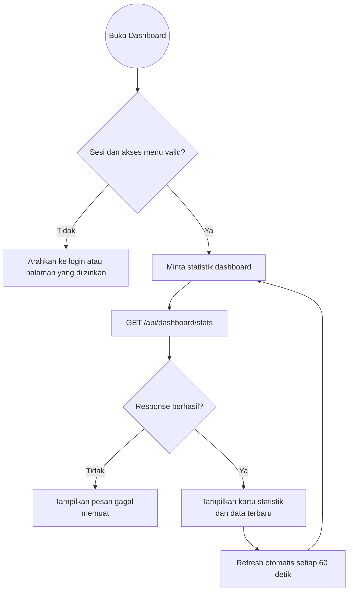
```mermaid
flowchart TD
    Start((Buka Dashboard)) --> Guard{Sesi dan akses menu valid?}
    Guard -- Tidak --> Redirect[Arahkan ke login atau halaman yang diizinkan]
    Guard -- Ya --> Request[Minta statistik dashboard]
    Request --> API[GET /api/dashboard/stats]
    API --> Success{Response berhasil?}
    Success -- Tidak --> Error[Tampilkan pesan gagal memuat]
    Success -- Ya --> Render[Tampilkan kartu statistik dan data terbaru]
    Render --> Refresh[Refresh otomatis setiap 60 detik]
    Refresh --> Request
```

### Sequence Diagram

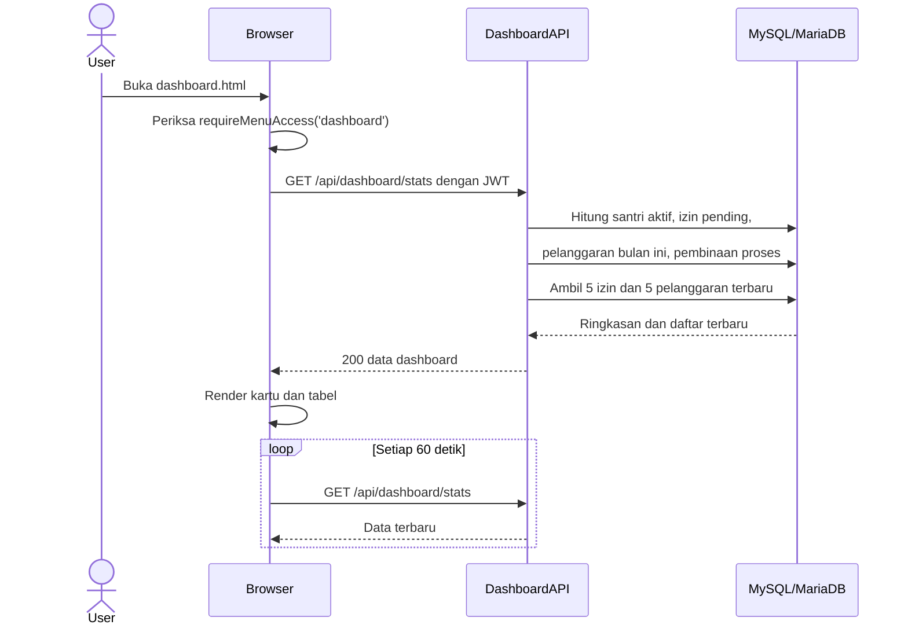
```mermaid
sequenceDiagram
    actor User
    participant Browser
    participant DashboardAPI
    participant DB as MySQL/MariaDB

    User->>Browser: Buka dashboard.html
    Browser->>Browser: Periksa requireMenuAccess('dashboard')
    Browser->>DashboardAPI: GET /api/dashboard/stats dengan JWT
    DashboardAPI->>DB: Hitung santri aktif, izin pending,
    DashboardAPI->>DB: pelanggaran bulan ini, pembinaan proses
    DashboardAPI->>DB: Ambil 5 izin dan 5 pelanggaran terbaru
    DB-->>DashboardAPI: Ringkasan dan daftar terbaru
    DashboardAPI-->>Browser: 200 data dashboard
    Browser->>Browser: Render kartu dan tabel
    loop Setiap 60 detik
        Browser->>DashboardAPI: GET /api/dashboard/stats
        DashboardAPI-->>Browser: Data terbaru
    end
```

## 4. Data Santri

### Activity Diagram

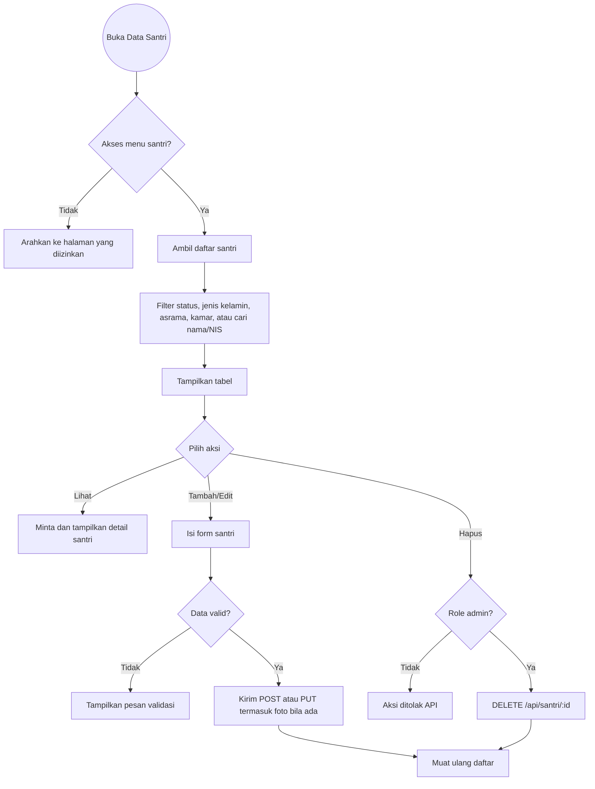
```mermaid
flowchart TD
    Start((Buka Data Santri)) --> Guard{Akses menu santri?}
    Guard -- Tidak --> Redirect[Arahkan ke halaman yang diizinkan]
    Guard -- Ya --> Load[Ambil daftar santri]
    Load --> Filter[Filter status, jenis kelamin, asrama, kamar, atau cari nama/NIS]
    Filter --> Render[Tampilkan tabel]
    Render --> Action{Pilih aksi}
    Action -- Lihat --> Detail[Minta dan tampilkan detail santri]
    Action -- Tambah/Edit --> Form[Isi form santri]
    Form --> Validate{Data valid?}
    Validate -- Tidak --> Error[Tampilkan pesan validasi]
    Validate -- Ya --> Save[Kirim POST atau PUT termasuk foto bila ada]
    Save --> Reload[Muat ulang daftar]
    Action -- Hapus --> Admin{Role admin?}
    Admin -- Tidak --> Denied[Aksi ditolak API]
    Admin -- Ya --> Delete[DELETE /api/santri/:id]
    Delete --> Reload
```

### Sequence Diagram

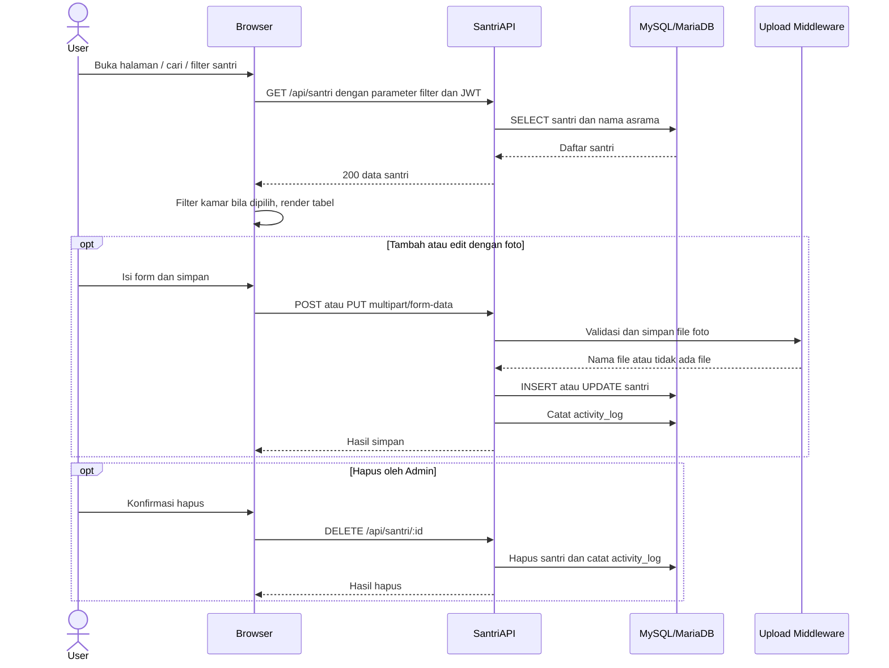
```mermaid
sequenceDiagram
    actor User
    participant Browser
    participant SantriAPI
    participant DB as MySQL/MariaDB
    participant Upload as Upload Middleware

    User->>Browser: Buka halaman / cari / filter santri
    Browser->>SantriAPI: GET /api/santri dengan parameter filter dan JWT
    SantriAPI->>DB: SELECT santri dan nama asrama
    DB-->>SantriAPI: Daftar santri
    SantriAPI-->>Browser: 200 data santri
    Browser->>Browser: Filter kamar bila dipilih, render tabel
    opt Tambah atau edit dengan foto
        User->>Browser: Isi form dan simpan
        Browser->>SantriAPI: POST atau PUT multipart/form-data
        SantriAPI->>Upload: Validasi dan simpan file foto
        Upload-->>SantriAPI: Nama file atau tidak ada file
        SantriAPI->>DB: INSERT atau UPDATE santri
        SantriAPI->>DB: Catat activity_log
        SantriAPI-->>Browser: Hasil simpan
    end
    opt Hapus oleh Admin
        User->>Browser: Konfirmasi hapus
        Browser->>SantriAPI: DELETE /api/santri/:id
        SantriAPI->>DB: Hapus santri dan catat activity_log
        SantriAPI-->>Browser: Hasil hapus
    end
```

## 5. Perizinan

### Activity Diagram

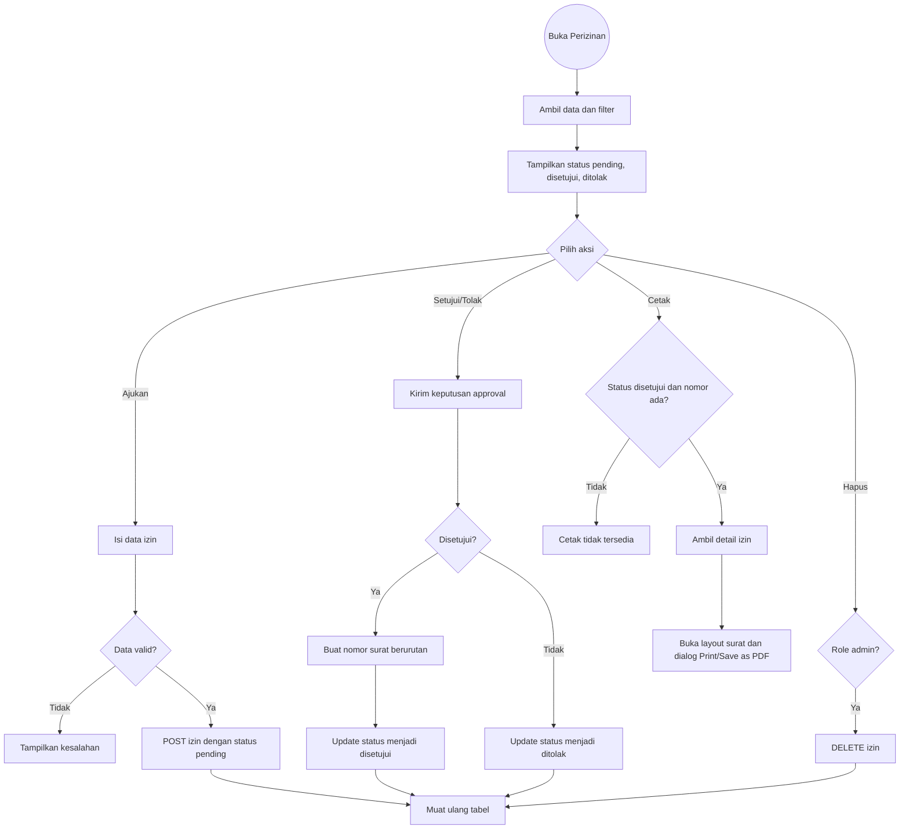
```mermaid
flowchart TD
    Start((Buka Perizinan)) --> Load[Ambil data dan filter]
    Load --> Render[Tampilkan status pending, disetujui, ditolak]
    Render --> Action{Pilih aksi}
    Action -- Ajukan --> Form[Isi data izin]
    Form --> Validate{Data valid?}
    Validate -- Tidak --> Error[Tampilkan kesalahan]
    Validate -- Ya --> Create[POST izin dengan status pending]
    Action -- Setujui/Tolak --> Approval[Kirim keputusan approval]
    Approval --> Approved{Disetujui?}
    Approved -- Ya --> Number[Buat nomor surat berurutan]
    Number --> Save[Update status menjadi disetujui]
    Approved -- Tidak --> Reject[Update status menjadi ditolak]
    Create --> Reload[Muat ulang tabel]
    Save --> Reload
    Reject --> Reload
    Action -- Cetak --> Check{Status disetujui dan nomor ada?}
    Check -- Tidak --> Block[Cetak tidak tersedia]
    Check -- Ya --> Detail[Ambil detail izin]
    Detail --> Print[Buka layout surat dan dialog Print/Save as PDF]
    Action -- Hapus --> Admin{Role admin?}
    Admin -- Ya --> Delete[DELETE izin]
    Delete --> Reload
```

### Sequence Diagram

```mermaid
sequenceDiagram
    actor User
    participant Browser
    participant PermitAPI as Perizinan API
    participant DB as MySQL/MariaDB
    participant Print as Dialog Cetak Browser

    User->>Browser: Buka daftar atau isi form izin
    Browser->>PermitAPI: GET /api/perizinan dengan JWT
    PermitAPI->>DB: SELECT izin, santri, jenis izin, user terkait
    DB-->>PermitAPI: Data perizinan
    PermitAPI-->>Browser: 200 daftar perizinan
    Browser->>Browser: Render tabel dan filter
    opt Ajukan izin
        Browser->>PermitAPI: POST /api/perizinan
        PermitAPI->>DB: INSERT status pending
        PermitAPI->>DB: INSERT activity_log
        PermitAPI-->>Browser: 201 id izin
    end
    opt Setujui izin
        Browser->>PermitAPI: PUT /api/perizinan/:id/approval status=disetujui
        PermitAPI->>DB: BEGIN; lock izin pending
        PermitAPI->>DB: Naikkan nomor_surat_counter tahunan
        PermitAPI->>DB: Simpan nomor SPS dan status disetujui
        PermitAPI->>DB: INSERT activity_log; COMMIT
        PermitAPI-->>Browser: 200 nomor_surat
    end
    opt Tolak izin
        Browser->>PermitAPI: PUT /api/perizinan/:id/approval status=ditolak
        PermitAPI->>DB: Simpan status dan catatan penolakan
        PermitAPI-->>Browser: 200 hasil penolakan
    end
    opt Cetak izin disetujui
        Browser->>PermitAPI: GET /api/perizinan/:id
        PermitAPI->>DB: Ambil izin, santri, asrama, dan jenis izin
        DB-->>PermitAPI: Data untuk surat
        PermitAPI-->>Browser: 200 detail izin dan nomor surat
        Browser->>Browser: Bentuk template surat
        Browser->>Print: Buka Print / Save as PDF
    end
```

## 6. Pelanggaran

### Activity Diagram

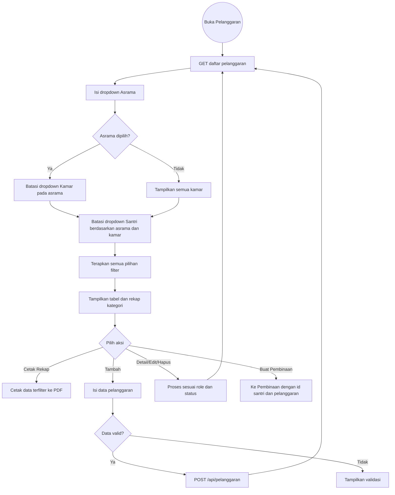
```mermaid
flowchart TD
    Start((Buka Pelanggaran)) --> Load[GET daftar pelanggaran]
    Load --> Populate[Isi dropdown Asrama]
    Populate --> Asrama{Asrama dipilih?}
    Asrama -- Ya --> Rooms[Batasi dropdown Kamar pada asrama]
    Asrama -- Tidak --> AllRooms[Tampilkan semua kamar]
    Rooms --> Santri[Batasi dropdown Santri berdasarkan asrama dan kamar]
    AllRooms --> Santri
    Santri --> Filter[Terapkan semua pilihan filter]
    Filter --> Render[Tampilkan tabel dan rekap kategori]
    Render --> Action{Pilih aksi}
    Action -- Cetak Rekap --> Print[Cetak data terfilter ke PDF]
    Action -- Tambah --> Form[Isi data pelanggaran]
    Form --> Validate{Data valid?}
    Validate -- Ya --> Create[POST /api/pelanggaran]
    Validate -- Tidak --> Error[Tampilkan validasi]
    Create --> Load
    Action -- Detail/Edit/Hapus --> Record[Proses sesuai role dan status]
    Record --> Load
    Action -- Buat Pembinaan --> Pembinaan[Ke Pembinaan dengan id santri dan pelanggaran]
```

### Sequence Diagram

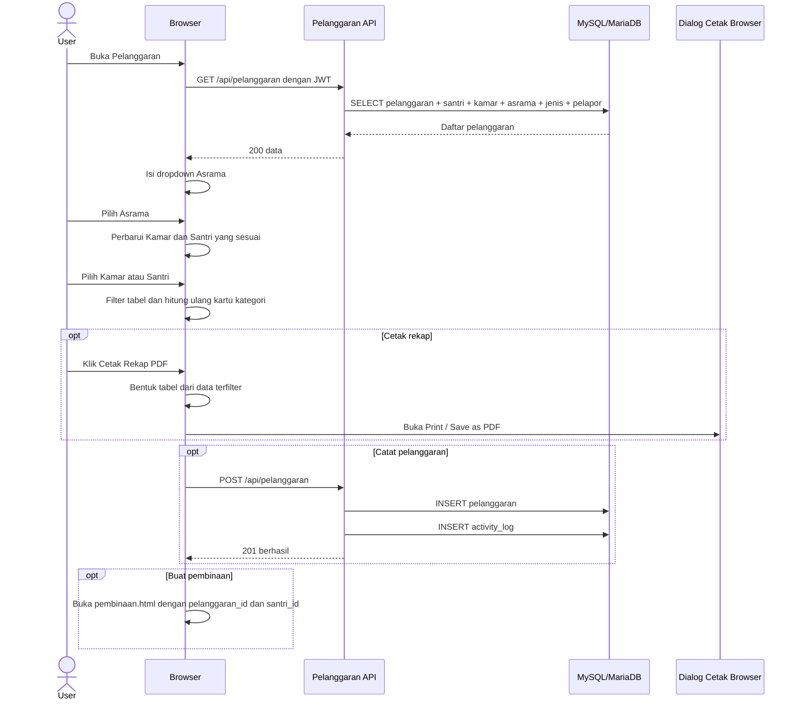
```mermaid
sequenceDiagram
    actor User
    participant Browser
    participant ViolationAPI as Pelanggaran API
    participant DB as MySQL/MariaDB
    participant Print as Dialog Cetak Browser

    User->>Browser: Buka Pelanggaran
    Browser->>ViolationAPI: GET /api/pelanggaran dengan JWT
    ViolationAPI->>DB: SELECT pelanggaran + santri + kamar + asrama + jenis + pelapor
    DB-->>ViolationAPI: Daftar pelanggaran
    ViolationAPI-->>Browser: 200 data
    Browser->>Browser: Isi dropdown Asrama
    User->>Browser: Pilih Asrama
    Browser->>Browser: Perbarui Kamar dan Santri yang sesuai
    User->>Browser: Pilih Kamar atau Santri
    Browser->>Browser: Filter tabel dan hitung ulang kartu kategori
    opt Cetak rekap
        User->>Browser: Klik Cetak Rekap PDF
        Browser->>Browser: Bentuk tabel dari data terfilter
        Browser->>Print: Buka Print / Save as PDF
    end
    opt Catat pelanggaran
        Browser->>ViolationAPI: POST /api/pelanggaran
        ViolationAPI->>DB: INSERT pelanggaran
        ViolationAPI->>DB: INSERT activity_log
        ViolationAPI-->>Browser: 201 berhasil
    end
    opt Buat pembinaan
        Browser->>Browser: Buka pembinaan.html dengan pelanggaran_id dan santri_id
    end
```

## 7. Pembinaan

### Activity Diagram

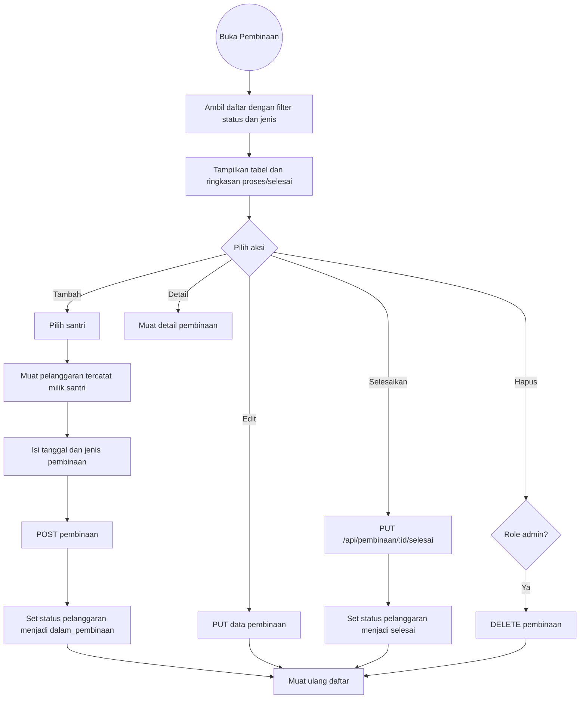
```mermaid
flowchart TD
    Start((Buka Pembinaan)) --> Load[Ambil daftar dengan filter status dan jenis]
    Load --> Render[Tampilkan tabel dan ringkasan proses/selesai]
    Render --> Action{Pilih aksi}
    Action -- Tambah --> SelectSantri[Pilih santri]
    SelectSantri --> SelectViolation[Muat pelanggaran tercatat milik santri]
    SelectViolation --> Form[Isi tanggal dan jenis pembinaan]
    Form --> Save[POST pembinaan]
    Save --> Mark[Set status pelanggaran menjadi dalam_pembinaan]
    Mark --> Reload[Muat ulang daftar]
    Action -- Edit --> Update[PUT data pembinaan]
    Update --> Reload
    Action -- Selesaikan --> Finish[PUT /api/pembinaan/:id/selesai]
    Finish --> UpdateViolation[Set status pelanggaran menjadi selesai]
    UpdateViolation --> Reload
    Action -- Detail --> Detail[Muat detail pembinaan]
    Action -- Hapus --> Admin{Role admin?}
    Admin -- Ya --> Delete[DELETE pembinaan]
    Delete --> Reload
```

### Sequence Diagram

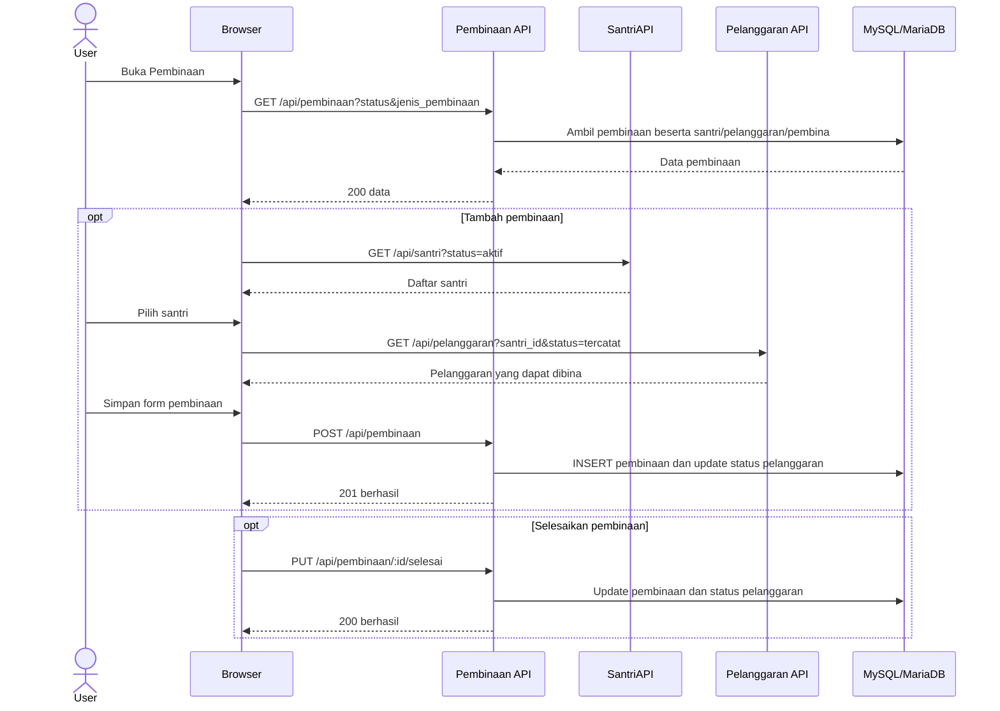
```mermaid
sequenceDiagram
    actor User
    participant Browser
    participant CoachingAPI as Pembinaan API
    participant SantriAPI
    participant ViolationAPI as Pelanggaran API
    participant DB as MySQL/MariaDB

    User->>Browser: Buka Pembinaan
    Browser->>CoachingAPI: GET /api/pembinaan?status&jenis_pembinaan
    CoachingAPI->>DB: Ambil pembinaan beserta santri/pelanggaran/pembina
    DB-->>CoachingAPI: Data pembinaan
    CoachingAPI-->>Browser: 200 data
    opt Tambah pembinaan
        Browser->>SantriAPI: GET /api/santri?status=aktif
        SantriAPI-->>Browser: Daftar santri
        User->>Browser: Pilih santri
        Browser->>ViolationAPI: GET /api/pelanggaran?santri_id&status=tercatat
        ViolationAPI-->>Browser: Pelanggaran yang dapat dibina
        User->>Browser: Simpan form pembinaan
        Browser->>CoachingAPI: POST /api/pembinaan
        CoachingAPI->>DB: INSERT pembinaan dan update status pelanggaran
        CoachingAPI-->>Browser: 201 berhasil
    end
    opt Selesaikan pembinaan
        Browser->>CoachingAPI: PUT /api/pembinaan/:id/selesai
        CoachingAPI->>DB: Update pembinaan dan status pelanggaran
        CoachingAPI-->>Browser: 200 berhasil
    end
```

## 8. Manajemen Asrama dan Kamar

### Activity Diagram

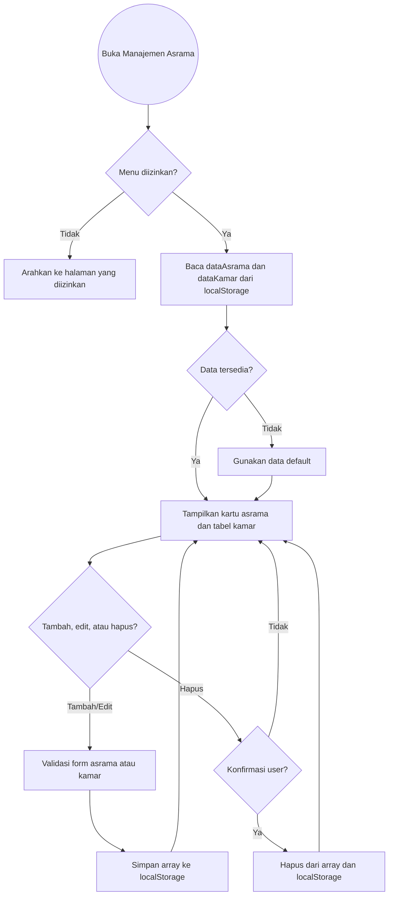
```mermaid
flowchart TD
    Start((Buka Manajemen Asrama)) --> Guard{Menu diizinkan?}
    Guard -- Tidak --> Redirect[Arahkan ke halaman yang diizinkan]
    Guard -- Ya --> Load[Baca dataAsrama dan dataKamar dari localStorage]
    Load --> Exists{Data tersedia?}
    Exists -- Tidak --> Defaults[Gunakan data default]
    Exists -- Ya --> Render[Tampilkan kartu asrama dan tabel kamar]
    Defaults --> Render
    Render --> Action{Tambah, edit, atau hapus?}
    Action -- Tambah/Edit --> Form[Validasi form asrama atau kamar]
    Form --> Save[Simpan array ke localStorage]
    Action -- Hapus --> Confirm{Konfirmasi user?}
    Confirm -- Ya --> Remove[Hapus dari array dan localStorage]
    Confirm -- Tidak --> Render
    Save --> Render
    Remove --> Render
```

### Sequence Diagram

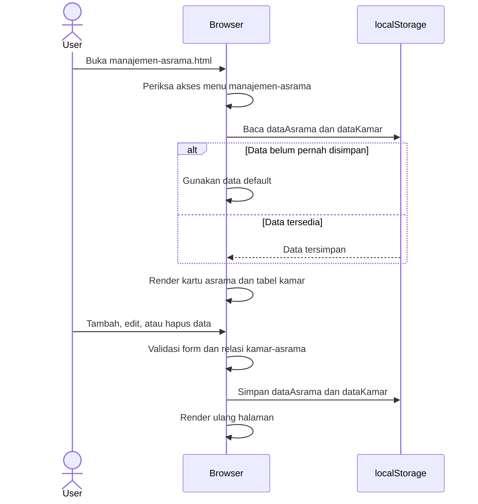
```mermaid
sequenceDiagram
    actor User
    participant Browser
    participant Storage as localStorage

    User->>Browser: Buka manajemen-asrama.html
    Browser->>Browser: Periksa akses menu manajemen-asrama
    Browser->>Storage: Baca dataAsrama dan dataKamar
    alt Data belum pernah disimpan
        Browser->>Browser: Gunakan data default
    else Data tersedia
        Storage-->>Browser: Data tersimpan
    end
    Browser->>Browser: Render kartu asrama dan tabel kamar
    User->>Browser: Tambah, edit, atau hapus data
    Browser->>Browser: Validasi form dan relasi kamar-asrama
    Browser->>Storage: Simpan dataAsrama dan dataKamar
    Browser->>Browser: Render ulang halaman
```

Catatan: halaman ini saat ini memakai `localStorage`; perubahan tidak disimpan ke tabel MySQL dan tidak otomatis terbagi antar-browser/perangkat.

## 9. Manajemen User

### Activity Diagram

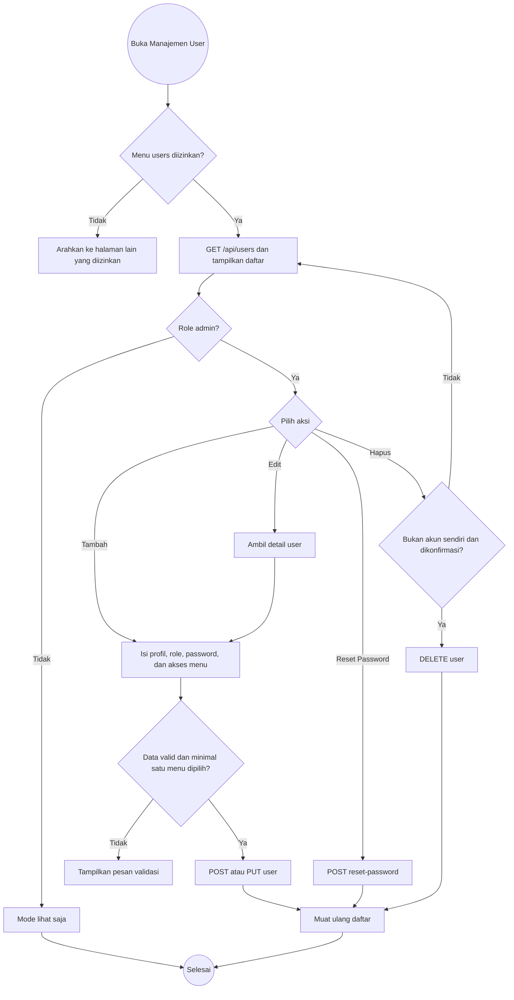
```mermaid
flowchart TD
    Start((Buka Manajemen User)) --> Menu{Menu users diizinkan?}
    Menu -- Tidak --> Redirect[Arahkan ke halaman lain yang diizinkan]
    Menu -- Ya --> Read[GET /api/users dan tampilkan daftar]
    Read --> Role{Role admin?}
    Role -- Tidak --> View[Mode lihat saja]
    Role -- Ya --> Action{Pilih aksi}
    Action -- Tambah --> Form[Isi profil, role, password, dan akses menu]
    Action -- Edit --> Load[Ambil detail user]
    Load --> Form
    Form --> Validate{Data valid dan minimal satu menu dipilih?}
    Validate -- Tidak --> Error[Tampilkan pesan validasi]
    Validate -- Ya --> Save[POST atau PUT user]
    Save --> Reload[Muat ulang daftar]
    Action -- Reset Password --> Reset[POST reset-password]
    Reset --> Reload
    Action -- Hapus --> Confirm{Bukan akun sendiri dan dikonfirmasi?}
    Confirm -- Tidak --> Read
    Confirm -- Ya --> Delete[DELETE user]
    Delete --> Reload
    View --> End((Selesai))
    Reload --> End
```

### Sequence Diagram

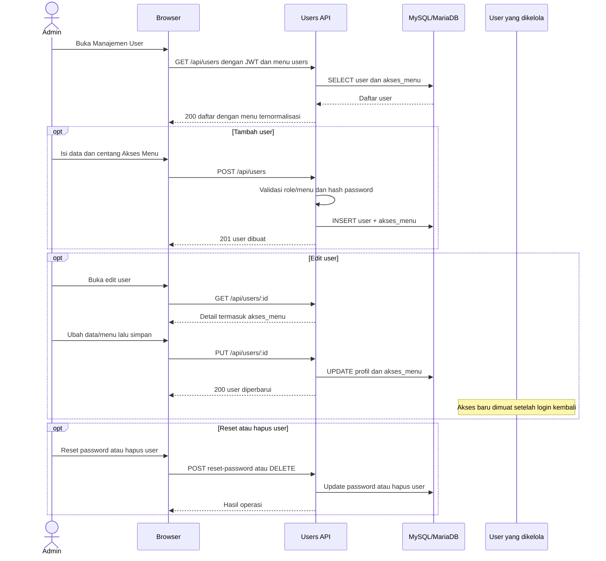
```mermaid
sequenceDiagram
    actor Admin
    participant Browser
    participant UsersAPI as Users API
    participant DB as MySQL/MariaDB
    participant Target as User yang dikelola

    Admin->>Browser: Buka Manajemen User
    Browser->>UsersAPI: GET /api/users dengan JWT dan menu users
    UsersAPI->>DB: SELECT user dan akses_menu
    DB-->>UsersAPI: Daftar user
    UsersAPI-->>Browser: 200 daftar dengan menu ternormalisasi
    opt Tambah user
        Admin->>Browser: Isi data dan centang Akses Menu
        Browser->>UsersAPI: POST /api/users
        UsersAPI->>UsersAPI: Validasi role/menu dan hash password
        UsersAPI->>DB: INSERT user + akses_menu
        UsersAPI-->>Browser: 201 user dibuat
    end
    opt Edit user
        Admin->>Browser: Buka edit user
        Browser->>UsersAPI: GET /api/users/:id
        UsersAPI-->>Browser: Detail termasuk akses_menu
        Admin->>Browser: Ubah data/menu lalu simpan
        Browser->>UsersAPI: PUT /api/users/:id
        UsersAPI->>DB: UPDATE profil dan akses_menu
        UsersAPI-->>Browser: 200 user diperbarui
        Note over Target: Akses baru dimuat setelah login kembali
    end
    opt Reset atau hapus user
        Admin->>Browser: Reset password atau hapus user
        Browser->>UsersAPI: POST reset-password atau DELETE
        UsersAPI->>DB: Update password atau hapus user
        UsersAPI-->>Browser: Hasil operasi
    end
```

## Ringkasan Endpoint per Halaman

| Halaman | Endpoint utama | Catatan |
| --- | --- | --- |
| Login | `POST /api/auth/login` | Menghasilkan JWT dan `akses_menu`. |
| Dashboard | `GET /api/dashboard/stats` | Ringkasan dan data terbaru. |
| Data Santri | `/api/santri` | CRUD; API membatasi aksi berdasarkan role. |
| Perizinan | `/api/perizinan` | Approval `disetujui` menghasilkan nomor surat; status final lainnya `ditolak`. |
| Pelanggaran | `/api/pelanggaran` | Rekap Asrama → Kamar → Santri dilakukan di browser dari daftar API. |
| Pembinaan | `/api/pembinaan` | Filter status dan jenis; terkait dengan pelanggaran. |
| Manajemen Asrama | `localStorage` | Belum menggunakan endpoint/API database. |
| Manajemen User | `/api/users` | Baca daftar mengikuti akses menu; mutasi user hanya admin. |
